# EventFlow - Smart Event Planning for Fitness Coaches

AI-powered event planning platform designed specifically for fitness coaches, with Google integration and intelligent workflows.

## Features

- **Guided Planning**: Step-by-step event planning with integrated forms
- **Event Dashboard**: Centralized tracking and management
- **Material Generator**: Automated ticket requests and flyer drafts
- **Calendar Integration**: Direct Google Calendar integration
- **Team Assignment**: Collaboration features for team management
- **Post-Event Analytics**: Survey and analytics dashboard

## Tech Stack

- **Frontend**: Next.js 14, TypeScript, Tailwind CSS
- **Backend**: Firebase (Firestore, Auth)

- **UI**: Framer Motion, Lucide React, Headless UI
- **Validation**: Zod, React Hook Form

## Getting Started

### Prerequisites

- Node.js 18+ 
- npm or yarn
- Firebase account

### Installation

1. **Clone the repository**
   ```bash
   git clone <repository-url>
   cd eventflow
   ```

2. **Install dependencies**
   ```bash
   npm install
   ```

3. **Set up Firebase**
   - Create a new Firebase project at [Firebase Console](https://console.firebase.google.com/)
   - Enable Firestore Database
   - Create a web app and get your configuration
   - Copy the config values to `.env.local`

4. **Environment Variables**
   Create a `.env.local` file in the root directory:
   ```env
   NEXT_PUBLIC_FIREBASE_API_KEY=your_api_key_here
   NEXT_PUBLIC_FIREBASE_AUTH_DOMAIN=your_project.firebaseapp.com
   NEXT_PUBLIC_FIREBASE_PROJECT_ID=your_project_id
   NEXT_PUBLIC_FIREBASE_STORAGE_BUCKET=your_project.appspot.com
   NEXT_PUBLIC_FIREBASE_MESSAGING_SENDER_ID=your_sender_id
   NEXT_PUBLIC_FIREBASE_APP_ID=your_app_id
   ```

5. **Run the development server**
   ```bash
   npm run dev
   ```

6. **Open your browser**
   Navigate to [http://localhost:3000](http://localhost:3000)

## Project Structure

```
eventflow/
├── app/                    # Next.js app directory
│   ├── globals.css        # Global styles
│   ├── layout.tsx         # Root layout
│   ├── page.tsx           # Landing page
│   └── event-setup/       # Event setup form
├── lib/                   # Utility libraries
│   ├── firebase.ts        # Firebase configuration
│   ├── firebase-events.ts # Event database operations
│   ├── types.ts           # TypeScript type definitions
│   └── validation.ts      # Form validation schemas
├── components/            # Reusable components
└── public/               # Static assets
```

## Event Planning Workflow

### Current Application Flow

```mermaid
graph TD
    A["🏠 Main Calendar"] --> B["➕ Create Event"]
    B --> C["📋 Event Setup Flow"]
    
    C --> D["1️⃣ Event Basics<br/>• Event Type<br/>• Date/Time<br/>• Location"]
    D --> E["2️⃣ Contact & Audience<br/>• Point of Contact<br/>• Event Purpose<br/>• Target Audience"]
    E --> F["3️⃣ Logistics & Requirements<br/>• Team Role Needs<br/>• Marketing Channels<br/>• Special Requirements"]
    F --> G["4️⃣ Review & Launch<br/>• Final Review<br/>• Create Event"]
    
    G --> H["✅ Event Created"]
    H --> I["🎯 Auto-Redirect to Logistics"]
    
    I --> J["📊 Logistics Page - Tab System"]
    J --> K["👥 Team Assignment Tab<br/>• Assign Team Members to Roles<br/>• Set Arrival Times<br/>• Contact Info Auto-Filled"]
    J --> L["📅 Schedule Tab<br/>• Event Timeline<br/>• Responsible Persons<br/>• Activity Details"]
    J --> M["📞 Contacts Tab<br/>• Team Contacts<br/>• Venue Contacts<br/>• Emergency Contacts"]
    J --> N["🎯 Activities Tab<br/>• Event Activities<br/>• Activity Management"]
    
    K --> O["💾 Save Logistics"]
    L --> O
    M --> O
    N --> O
    
    O --> P["🏁 Completion Screen<br/>• Summary of Assignments<br/>• Print Event Plan<br/>• Return to Calendar"]
    P --> A
    
    style C fill:#e1f5fe
    style I fill:#f3e5f5
    style J fill:#fff3e0
    style P fill:#e8f5e8
```



### Original 9-Step Vision

The app was originally designed to guide users through 9 comprehensive steps:

1. **Event Kickoff & Info Gathering** - Collect event details ✅ *Implemented*
2. **Marketing & Promotion Schedule** - AI-powered timeline planning
3. **Day-of Logistics** - Team roles and scheduling ✅ *Implemented*
4. **Venue & Space Booking** - Location confirmation
5. **Event Tickets** - GEMS ticket creation
6. **Marketing Materials** - Flyers and distribution
7. **Materials & Equipment** - Equipment checklist
8. **Vendor Confirmation** - Partner management
9. **Post-Event Follow-Up** - Evaluation and analytics

## Development

### Available Scripts

- `npm run dev` - Start development server
- `npm run build` - Build for production (Firebase Hosting ready)
- `npm run start` - Start production server
- `npm run lint` - Run ESLint

### Key Features Implemented

- ✅ Multi-step form with validation
- ✅ Firebase integration
- ✅ Auto-save functionality
- ✅ Event templates
- ✅ Responsive design
- ✅ TypeScript support
- ✅ Error handling

### Next Steps

- [ ] Step 2: Marketing & Promotion Schedule
- [ ] Step 3: Day-of Logistics
- [ ] Google Calendar integration
- [ ] Team collaboration features
- [ ] Post-event analytics

## Contributing

1. Fork the repository
2. Create a feature branch
3. Make your changes
4. Add tests if applicable
5. Submit a pull request

## License

This project is licensed under the MIT License. 